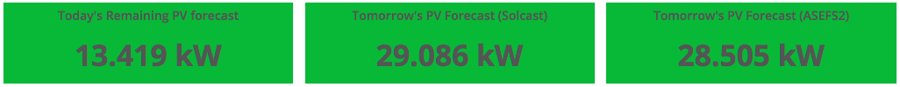

# mySolarForecast



Retrieve Solar PV forecasts from Solcast and the [Australia Solar Energy 
Forecast System (ASEFS)](https://www.aemo.com.au/Electricity/National-Electricity-Market-NEM/Planning-and-forecasting/Solar-and-wind-energy-forecasting).

Two Solar PV forecast sources are used for comparison purposes. The forecasts 
are recorded in InfluxDB.

## Prequisites

An [AWS account](https://aws.amazon.com). mySolarForecast is an AWS Lamdba 
function. 

If this will be your only Lambda function, you will remain within the 
[AWS Free Tier](https://aws.amazon.com/lambda/pricing/). There will be nominal 
charges (a few cents per month) for Amazon S3 and data transfers.

To deploy the AWS Lamdba function, the [Serverless](https://serverless.com/framework/docs/providers/aws/guide/installation/) framework is used.

## Installation

1. Download or clone this repository to your local workstation.

### Serverless Framework

2. To ease the setup and configuration of this Lamdba, Serverless is used to 
deploy the code and it's dependancies.

   On your local workstation, install [serverless](https://serverless.com/framework/docs/providers/aws/guide/installation/).

   ```
   npm install serverless
   ```

3. Setup your AWS Profile as per [Serverless guidelines](https://serverless.com/framework/docs/providers/aws/guide/credentials/).

4. Edit serverless.yml and update the following API credentials and UTC timezone offset:

   ```
   influxdb_ip: "XXX.XXX.XXX.XXX"
   influxdb_port: XXXX
   influxdb_user: "XXXXXXXX"
   influxdb_password: "XXXXXXXX"
   influxdb_database: "XXXXXXXX"
   influxdb_ssl: "True or False"
   influxdb_verify_ssl: "False or True"
   influxdb_measurement: "XXXXXXXX"
   influxdb_location: "XXXXXXXX"
   long: -XX.XXXXXX
   lat: XXX.XXXXX
   solcast_api_key: "XXXXXXXX"
   # See Solcast Power API: https://solcast.com.au/api/docs/pv_power.html
   # Where each PV orientation is a tuple (azimuth, capacity). 
   # Example 1: 5K North facing system: [(0,5000)]
   # Example 2: 5K East and West: [(-90,2500),(90,2500)]
   pv_roof: "[(XXX,XXXX),(-XX,XXXX)]"
   ```

### Deployment

5. Deploy mySolarForecast:

   From your local workstation, deploy mySolarForecast to AWS:

   ```
   serverless deploy 
   ```

### Next Steps

Now that you are collecting the inverter's data, you'll want to ultimately 
display it in a dashboard as seen above.

mySolarForecast uses InfluxDB as a time series database to store the forecasts.

The following metrics are available:

pv_solcast for tomorrow's Solcast's forecast.
pv_solcast_today for the Solar forecast for the remainder of the day.
pv_forecast for tomorrow's ASEFS's forecast.

To display the data in real time dashboard, you can use 
[Grafana](https://grafana.com/get) to pull the metrics from InfluxDB. You can 
either install your own Grafana server or use their free 
[Grafana hosted solution](https://grafana.com/cloud/grafana).

Note, as the forecast is for tomorrow (24 hours from now), to retrieve today's
forecast you can either time shift 24 hours back or retireve the remaining
forecast values from InfluxDB metric: "pv_solcast_today".
